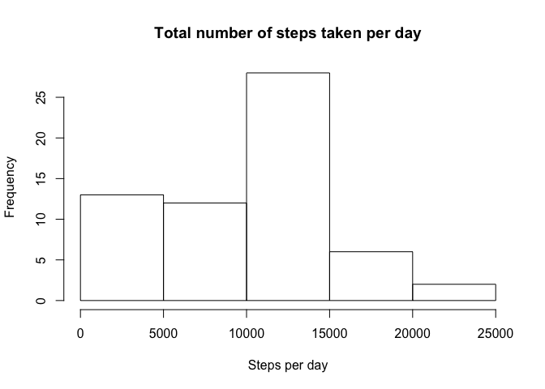

## Loading data


```r
if(!file.exists('activity.csv')){
    unzip('activity.zip')
}
dt <- read.csv('activity.csv', colClasses = c("numeric", "Date", "numeric"))
```

-----

## What is mean total number of steps taken per day?

```r
steps_per_day <- aggregate(dt$steps, by = list(dt$date), FUN = sum, na.rm = TRUE)
```

##### 1. Histogram of total number of steps per day

```r
hist(steps_per_day$x, xlab = "Steps per day", main = "Total number of steps taken per day")
```

<!-- -->

##### 2. Mean and median

```r
stepsMean <- mean(steps_per_day$x)
stepsMedian <- median(steps_per_day$x)
```
* Mean: 9354.2295082
* Median:  1.0395\times 10^{4}

-----

## What is the average daily activity pattern?

```r
averageIntervals <- aggregate(dt$steps, by = list(dt$interval), FUN=mean, na.rm=TRUE)
colnames(averageIntervals)<-c("Intervals","Steps")
```

##### 1. Time series plot

```r
library(ggplot2)
ggplot(aes(x=Intervals,y=Steps),data=averageIntervals)+geom_line()
```

<!-- -->

##### 2. Interval with the maximum number of steps

```r
averageIntervals[which.max(averageIntervals$Steps),1]
```

```
## [1] 835
```

----

## Imputing missing values
##### 1. Total number of missing values in the dataset 

```r
sum(is.na(dt$steps))
```

```
## [1] 2304
```

##### 2. Filling missing values

```r
dt$steps[is.na(dt$steps)]<-mean(dt$steps, na.rm = TRUE)
```

##### 3. Histogram of the total number of steps per day 

```r
steps_per_day <- aggregate(dt$steps, by = list(dt$date), FUN = sum)
hist(steps_per_day$x, xlab = "Steps per day", main = "Total number of steps taken per day")
```

<!-- -->

##### 4. Mean and median 

```r
stepsMean <- mean(steps_per_day$x)
stepsMedian <- median(steps_per_day$x)
```
* Mean: 1.0766189\times 10^{4}
* Median:  1.0766189\times 10^{4}

----

## Differences in activity patterns between weekdays and weekends?
##### 1. Factor for “weekday” and “weekend”


```r
dt$days=tolower(weekdays(dt$date))
dt$daysType<-ifelse(dt$days == "saturday" | dt$days == "sunday", "weekend", "weekday")
```

##### 2. Panel plot containing a time series plot


```r
avgsteps <- aggregate(dt$steps, by = list(dt$interval, dt$daysType), FUN = mean)
colnames(avgsteps)<-c("Interval","Daytype","Steps")

ggplot(aes(x=Interval,y=Steps),data=avgsteps)+geom_line()+facet_wrap(~avgsteps$Daytype)
```

<!-- -->
